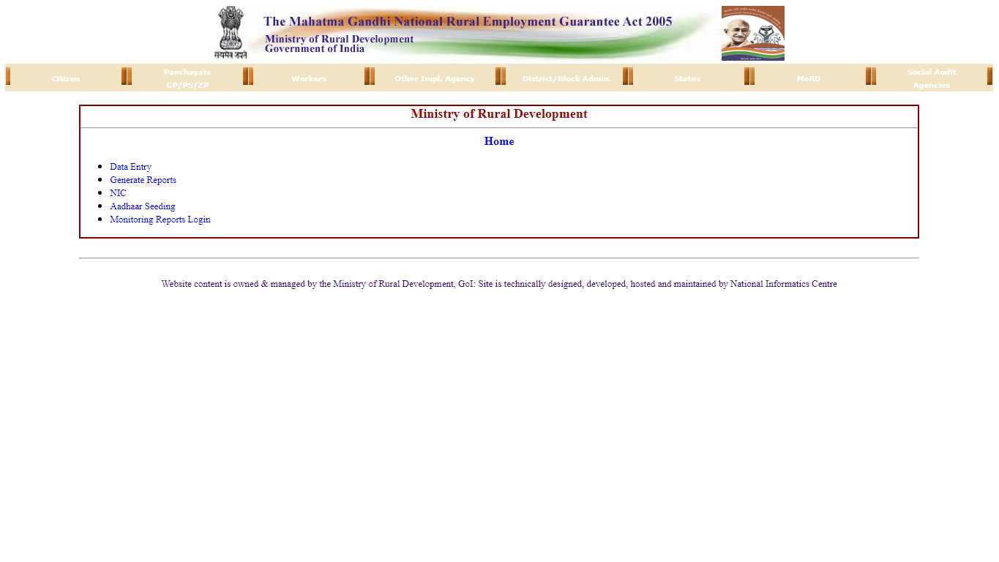
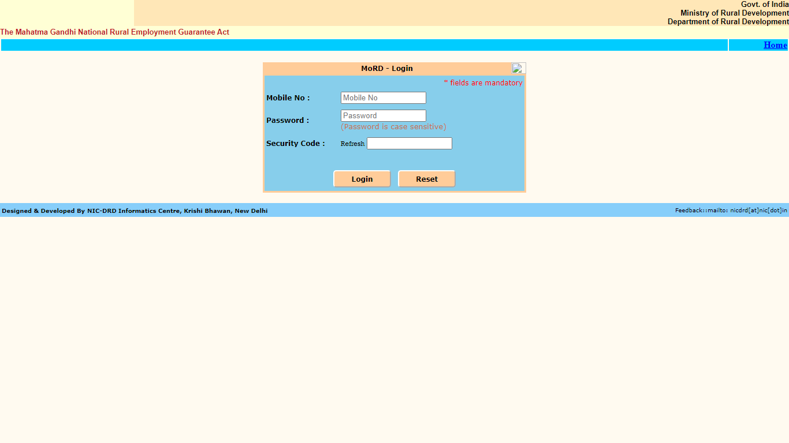

# brief-shirt-7318

This project is a team project of 5 members, Trip Advisor is an online traveling and hotel booking website. We built this cloning project
Within 5 days and this is our first project during the Masai curriculum 
https://harmonious-kleicha-110553.netlify.app/

## Installation

- copy this https://github.com/sunnylalwani41/brief-shirt-7318.git
- Select path where you want to store the project in your pc
- open the corresponding file / folder with editor
- open terminal of your editor
- use  --> git clone (paste link) <-- 
- after project cloned to your folder
- go to index.html inside homenavbar folder
- open with live server
    
## Tech Stack

* Javascript
* HTML
* CSS

# Screenshots
## Landing Page

## Internal Page

## Login Page

